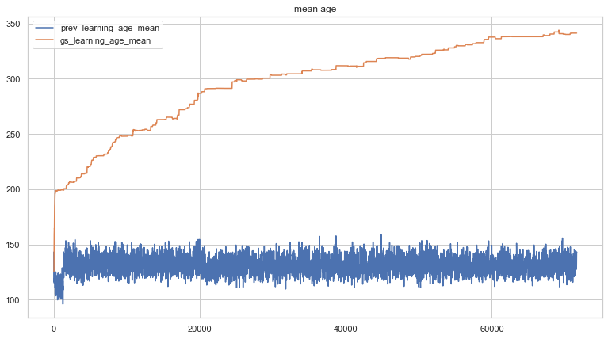
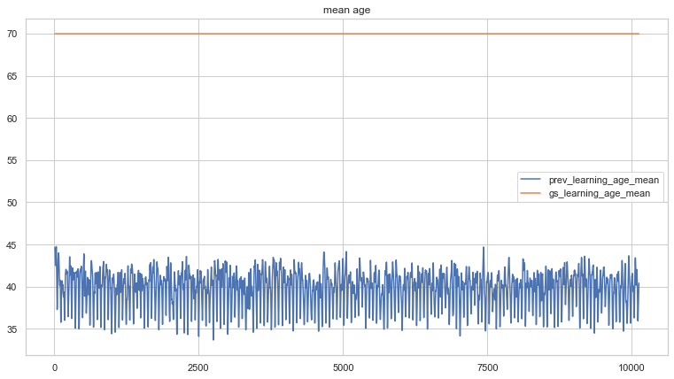
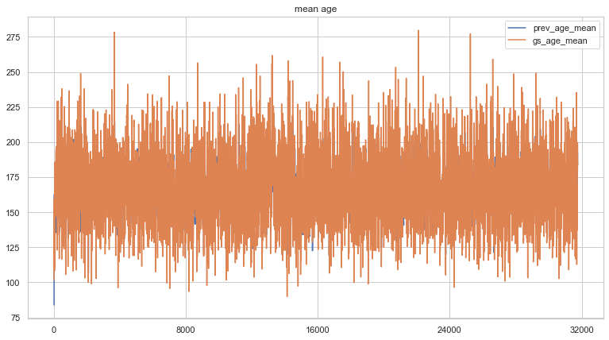

## Forewarning
What follows is old news, some of which I've now figure out. For instance, putting agents in an environment where their only goal is to live longer by finding and eating food is, apparently, a really hard policy to learn (from both genetic algorithm and reinforcement learning perspectives). This is something that is quite contrary to all life on this planet. However, certain other policies, such as learning to evade predators, are really easy to learn. My focus now will be on identfying tasks that are seemingly simple to living beings, but overly complex to agents, and figuring out why training takes so long and what might be done to speed up that training.

Learning a policy quickly means reducing the inputs, hidden, and outputs to the smallest number of parameters. For instance, the evade policy was evolved in 15 minutes using an agent with 4 input, 8 hidden, and 4 output. Simple tasks can be accomplished in this way, but multi-step tasks are much more difficult to learn with sparse rewards. For instance, move to and eat food could not be learned quickly, whereas move to and stay near protector could be. Perhaps breaking down tasks into small, easily learnable blocks is the way to create fast learning policies?

More to come...

## Introduction
This repository contains code that implements an environment for simulated organisms to learn and evolve behaviours. The environment itself is a two-dimensional toroidal plane - organisms that travel over an edge appear at the opposite edge of the plane in a similar fashion to how pacman moves. The environment presents a number of problems the organisms must learn to solve:

1. Organisms have energy that depletes. Consuming food replenishes that energy as long as the organism isn't already at full energy. Organisms must pick food and then eat it. They can store a finite number of food, and thus the action of picking food only works if they aren't already carrying the maximum amount. Organisms can also drop food. Dropped food can be picked up by other organisms. After a fixed time, dropped food will either expire and disappear, or cause a new plant to sprout.
2. Predators exist in the environment that can eat organisms. Predators move using very simple hard-coded logic (if they can see organisms ahead, move forward, otherwise move in a random fashion). Organisms must thus learn to evade predators.
3. Environmental effects are simluated. Night and day cycles affect the distance organisms can "see". Cold and hot cycles affect the drain on organisms' energy. During cold periods, organisms can increase their temperature by being close to other organisms. During hot periods, organisms must spread out.

Organisms can perform rotation and propulsion movement actions and can pick, eat, and drop food. They can also emit pheromone, mate with another organism (if certain conditions are satisfied), and modify the frequency of an input oscillator signal. Organisms can "see" further in the direction they're facing, but can also "sense" things above, below, to the left, and to the right of their position. Organisms can propel in the direction they're facing, as well as in up, down, left and right directions.

Organism logic is represented by simple feed-forward neural networks. Inputs are observations from the environment that include signals when other organisms, food, and predators are close by or in view, signals from pheromone present in the environment, information about themselves (position, velocity, energy, orientation, age, temperature, inventory, etc.), signals denoting whether they can mate and whether a suitable mate is in range, and various oscillators. Outputs of the neural network tie into organism actions.

Organisms are trained either by evolution, reinforcement learning, or a hybrid of the two. The weights of the neural networks are used as each organism's genome. Genomes from organisms that perform the best are stored and used for reproduction, or to replace an ill-performing learning agent's weights after a specified evaluation period. When an evolving organism dies it is replaced with a new one at a random location that contains a genome evolved from the best genome store. If a learning agent dies, backpropagation is used to train its neural network (using A2C) and it is respawned at a new random location. If a learning agent fails its evaluation, it is replaced with a new learning agent that receives neural network weights from a random item from the best genome store.

The purpose of this simulation is:
- to observe and document interesting emergent behaviours in the simulated swarm
- to understand whether evolution can be used to improve reinforcement learning mechanisms

Unfortunately, at this moment, the agents in this simulation are not able to learn policies that improve their longevity within a reasonable time frame. I was hoping that using evolved policies as a starting point for learning agents might speed up (or bootstrap) the reinforcement learning process, but this is clearly not the case. Although the mean age of policies in genome_store increases over time, the policies themselves, when viewed using the visual simulator, don't do what we'd expect (i.e. move around to evade predators, pick and eat food, etc.). I'm not sure whether letting this thing run for a much longer period (instead of overnight) would help improve that. I'm ultimately interested in discovering a mechanism that can train these agents in a reasonable timeframe.

## Results: effects of learning, evolution, and a hybrid approach on organism age

The following figure depicts a plot of the mean age of 20 evolving agents in both previous_agents (the last 100 agent runs) and genome_store (the best 100 recorded agent runs) over a 24-hour period from start of training. All experiments involved agents with a hidden layer configuration of [64, 128, 64]. During this period, the simulation had executed 1,197,886 steps and spawned 212,606 new agents. Agents in genome_store had a mean age of 631.09, with a maximum recorded age of 789.00 and a minimum recorded age of 577.00.

Here is a plot of the hybrid experiment run during the same 24 hour period as the other two experiments. The simulation contained 10 evolving agents and 10 learning agents. During this period, the simulation executed 919,921 steps and spawned 87,189 new evolving agents and 76,936 learning agents. Learning agents in genome_store had a mean age of 350.00 with maximum age 380.00 and minimum age 324.00. Evolving agents in the genome_store had a mean age of 382.11, a maximum age of 599.00 and a minimum age of 320.00.

Finally, here is a plot of the learning-only experiment over the same 24 hour period. The simulation contained 20 learning agents. Agents were evaluated every 30 full runs - if their age on the final run was less then 75% of the mean age of agents stored in genome_store, their genome was replaced by a random choice from the top 20% of genomes in genome_store. During this period, the simulation executed 1,175,175 steps and spawned 262,570 new agents. During evaluation, 8,572 agents received new genomes from genome_store and 172 agents continued with their learned policy. Learning agents in genome_store had a mean age of 328.64, a maximum age of 687.00, and a minimum age: 278.00.

Evolution clearly produced agents with the best longevity (632.09) during the training period. The hybrid approach produced learning agents with a slightly better mean age (350) than that of a learning-only approach (328.64). Evolving agents in the hybrid approach achieved a mean age score (382.11) that was much lower than an evolution-only (631.09) strategy.

The genomes captured from the evolution-only experiment were loaded separately and visualized. This visualization can be seen in the following animated gif, which shows how most of the agents remain stationary, do not evade predators, and do not pick or eat food. It is possible that the agents exhibit no movements due to the fact that the get_action() function is designed to be used for A2C-style reinforcement learning and thus outputs a sample of a categorical probability distribution of the softmax output of the model, and not the argmax of those values. Further testing is required to determine whether this is the case.

Below is a similar visualization for learned policies. Even though the mean age of agents in genome_store was considerably lower than those in the evolved-only experiments, these agents actually move around and even "swarm". Still, they don't behave as expected.

Below is a visualization of the results of 24 hours or training the hybrid experiment. Pink organisms are learned and blue are evolved. Both types move a lot more than those trained using the evolution only approach.

Given that the learning-only methodolody produced the most interesting policy, I ran the same experiment, but allowed it to train for longer. Below is a plot of that experiment, containing 30 learning agents, which ran for 2,549,614 steps during which 800,748 new agents were spawned. During evaluation (after 30 episodes), 26,184 agents were given a genome from the pool and 492 continued with their current genome. At the end of the run, genome_store contained policies with a mean age of 341.34, a maximum age of 846.00 and a minimum age of 161.00.

The resulting captured policy looked like this in the simulator:

As you can see, despite the fact that the mean age of policies captured continued to increase during this run, the resulting policies, when viewed in the simulation, still don't behave as expected.

The agents in the above experiments start with 200 energy, and thus have plenty of time to interact with the environment. One would expect that the need to learn to evade predators likely initially outweighs the need to learn to pick and eat food. Agents that start with a lower energy value would probably need to learn the opposite first, and it could be thus assumed that the age of agents in such an experiment should increase more quickly. In order to test this, I ran another learner-only experiment containing 20 learner agents with a start energy of 50. This experiment was allowed to run overnight. 508,101 steps were executed, with 263,006 new agents being spawned. At the end of the experiment, genome_stoe contained agents with a mean age of 70.00, a max age of 70.00, and a min age of 70.00. A plot of the run is depicted below.

The visualized policies learned during this experiment are shown below.

It is clear that the agents quickly hit a wall in which they are unable to learn anything new. Perhaps this is due to there being too few parameters in their neural networks. I decided to investigate a new reinforcement learning approach described in **Giving Up Control: Neurons as Reinforcement Learning Agents** (https://arxiv.org/abs/2003.11642). I slightly repurposed the NaRLA code (from https://github.com/Multi-Agent-Networks/NaRLA) in order to have it work with my simulated environment. Even with low numbers of layers and neurons, this approach is much more resource-intensive than the plain feed-forward networks used in my other experiments. As a tradeoff between resource usage and network size, I opted to use one layer of 16 NaRLA neurons. I also modified the original author's experiment parameters and set the size of each neuron's network to 16 (instead of the original 32). Network update used the "sync" setting, and I chose "all" rewards. Due to the heavy required resource load, I ran a simulation environment containing only 10 agents. Also, instead of collecting a pool of best genomes, I simply saved all ten policies. Thus the age plot during this experiment is not directly comparable to those in previous experiments. The age plot is shown below:

The experiment executed 1,587,524 steps (over several days) and 95,038 episodes. At the moment the experiment was shut down, the mean age of agents in the pool was 237.9. Below is a visual capture of the policy. As you can see from the above, agents failed to learn to live longer during the experiment.

This policy is the most interesting yet, but the agents still fail to behave as expected. Further experimentation with NaRLA might be interesting. I used the policy gradient approach implemented by the original author for the above experiment, but would like to modify the mechanism to use A2C instead. Also, different neural arrangements might be worth trying.

Ultimately, these experiments prove that current techniques for training agents are way too slow. I originally created this experiment in order to observe emergent behaviour between organisms in a simulation. My plan was to add additional complexity to the simulation in the form of items and entities to interact with. However, what happened instead was a failed search for a method to train these simple agents in the first place.

# Technical details
The whole simulation is implemented in **alien_ecology.py**. If you want to try running this yourself, you will likely need to install some python packages, including numpy, ursina, and torch (pyTorch). To run the simulation, just type:

python alien_ecology.py

at the command line. To see visual output, append **-v** to the above command line. Note that ursina aggressively leaks memory, so don't leave the visual simulator running for too long.

You can view stats from the experiment by running the accompanying plot_stats.ipynb notebook.

All other options will require editing the file itself, since I didn't bother parameterizing them. Look for class game_space and edit the inputs to the init function. Here are a few tips:

- **hidden_size** defines the shape of the hidden layers in the neural network
- **num_prev_states** allows you to set how many previous observation sets are present in the model's input
- **top_n** defines the portion of genomes to select from either previous_agents or genome_store when reproducing or spawning new agents
- **learners** defines the split between learning agents and evolving agents. At 1.0, the simulation is all learners. At 0.0, the simulation is all evolvers.
- **area_size** defines the width and height of the simulated area. It is always a square shape.
- **num_agents** defines the number of agents to run in the simulation
- **agent_start_energy** defines agent starting energy. It will decay by one per step, or more if it is too hot or cold.
- **num_predators** defines the number of predators in the simulation. If you want to have fun, increase the speed and inertial_damping values in class Predator.
- **min_reproduction_age** and **min_reproduction_energy** define the constraints for mating. Setting these to low values will cause a population explosion that's worth seeing at least once, even if it does bring the whole thing to a crawl.
- **fitness_index** if set to 1 will evaluate new genomes based on fitness, and if set to 2 will base on age
- **respawn_genome_store** - when evolving agents are respawned, how likely are their new genomes to come from genome_store instead of previous_agents
- **rebirth_genome_store** - same as above but for learning agents

Note that you can also change the simulation by commenting out items in self.actions and/or self.observations.

A second learner-only experiment (alien_ecology_NaRLA.py) is included whose agents implement logic described in: Giving Up Control: Neurons as Reinforcement Learning Agents (https://arxiv.org/abs/2003.11642). The original code for implementing NaRLA can be found here: https://github.com/Multi-Agent-Networks/NaRLA

