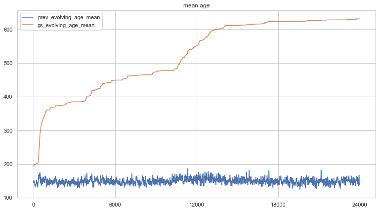
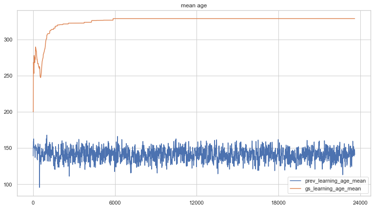

# alien_ecology
An environment for evolving alien creatures

## Introduction
This repository contains code that implements an environment for simulated organisms to learn and evolve behaviours. The environment itself is a two-dimensional toroidal plane - organisms that travel over an edge appear at the opposite edge of the plane in a similar fashion to how pacman moves. The environment presents a number of problems the organisms must learn to solve:

1. Organisms have energy that depletes. Consuming food replenishes that energy as long as the organism isn't already at full energy. Organisms must pick food and then eat it. They can store a finite number of food, and thus the action of picking food only works if they aren't already carrying the maximum amount. Organisms can also drop food. Dropped food can be picked up by other organisms. After a fixed time, dropped food will either expire and disappear, or cause a new plant to sprout.
2. Predators exist in the environment that can eat organisms. Predators move using very simple hard-coded logic (if they can see organisms ahead, move forward, otherwise move in a random fashion). Organisms must thus learn to evade predators.
3. Environmental effects are simluated. Night and day cycles affect the distance organisms can "see". Cold and hot cycles affect the drain on organisms' energy. During cold periods, organisms can increase their temperature by being close to other organisms. During hot periods, organisms must spread out.

Organisms can perform rotation and propulsion movement actions and can pick, eat, and drop food. They can also emit pheromone, mate with another organism (if certain conditions are satisfied), and modify the frequency of an input oscillator signal. Organisms can "see" further in the direction they're facing, but can also "sense" things above, below, to the left, and to the right of their position. Organisms can propel in the direction they're facing, as well as in up, down, left and right directions.

Organism logic is represented by simple feed-forward neural networks. Inputs are observations from the environment that include signals when other organisms, food, and predators are close by or in view, signals from pheromone present in the environment, information about themselves (position, velocity, energy, orientation, age, temperature, inventory, etc.), signals denoting whether they can mate and whether a suitable mate is in range, and various oscillators. Outputs of the neural network tie into organism actions.

Organisms are trained either by evolution, reinforcement learning, or a hybrid of the two. The weights of the neural networks are used as each organism's genome. Genomes from organisms that perform the best are stored and used for reproduction, or to replace an ill-performing learning agent's weights after a specified evaluation period. When an evolving organism dies it is replaced with a new one at a random location that contains a genome evolved from the best genome store. If a learning agent dies, backpropagation is used to train its neural network (using A2C) and it is respawned at a new random location. If a learning agent fails its evaluation, it is replaced with a new learning agent that receives neural network weights from a random item from the best genome store.

The purpose of this simulation is:
- to observe and document interesting emergent behaviours in the simulated swarm
- to understand whether evolution can be used to improve reinforcement learning mechanisms

Unfortunately, at this moment, the agents in this simulation are not able to learn policies that improve their longevity within a reasonable time frame. I was hoping that using evolved policies as a starting point for learning agents might speed up (or bootstrap) the reinforcement learning process, but this is clearly not the case. Although the mean age of policies in genome_store increases over time, the policies themselves, when viewed using the visual simulator, don't do what we'd expect (i.e. move around to evade predators, pick and eat food, etc.). I'm not sure whether letting this thing run for a year or two (instead of overnight) would help improve that, but I don't have the time to find that out.

See videos in the media folder for examples.

## Results: effects of learning, evolution, and a hybrid approach on organism age

The following figure depicts a plot of the mean age of 20 evolving agents in both previous_agents (the last 100 agent runs) and genome_store (the best 100 recorded agent runs) over a 24-hour period from start of training. During this period, the simulation had executed 1,197,886 steps and spawned 212,606 new agents. Agents in genome_store had a mean age of 631.09, with a maximum recorded age of 789.00 and a minimum recorded age of 577.00.

Here is a plot of the hybrid experiment run during the same 24 hour period as the other two experiments. The simulation contained 10 evolving agents and 10 learning agents. During this period, the simulation executed 919,921 steps and spawned 87,189 new evolving agents and 76,936 learning agents. Learning agents in genome_store had a mean age of 350.00 with maximum age 380.00 and minimum age 324.00. Evolving agents in the genome_store had a mean age of 382.11, a maximum age of 599.00 and a minimum age of 320.00.

Finally, here is a plot of the learning-only experiment over the same 24 hour period. The simulation contained 20 learning agents. Agents were evaluated every 30 full runs - if their age on the final run was less then 75% of the mean age of agents stored in genome_store, their genome was replaced by a random choice from the top 20% of genomes in genome_store. During this period, the simulation executed 1,175,175 steps and spawned 262,570 new agents. During evaluation, 8,572 agents received new genomes from genome_store and 172 agents continued with their learned policy. Learning agents in genome_store had a mean age of 328.64, a maximum age of 687.00, and a minimum age: 278.00.

Evolution clearly produced agents with the best longevity (632.09) during the training period. The hybrid approach produced learning agents with a slightly better mean age (350) than that of a learning-only approach (328.64). Evolving agents in the hybrid approach achieved a mean age score (382.11) that was much lower than an evolution-only (631.09) strategy.

The genomes captured from the evolution-only experiment were loaded separately and visualized. This visualization can be seen in the following animated gif.

As you can see, most of the agents remain stationary, do not evade predators, and do not pick or eat food.

# Technical details
The whole simulation is implemented in **alien_ecology.py**. If you want to try running this yourself, you will likely need to install some python packages, including numpy, ursina, and torch (pyTorch). To run the simulation, just type:

python alien_ecology.py

at the command line. To see visual output, append **-v** to the above command line. Note that ursina aggressively leaks memory, so don't leave the visual simulator running for too long.

You can view stats from the experiment by running the accompanying plot_stats.ipynb notebook.

All other options will require editing the file itself, since I didn't bother parameterizing them. Look for class game_space and edit the inputs to the init function. Here are a few tips:

- **hidden_size** defines the shape of the hidden layers in the neural network
- **num_prev_states** allows you to set how many previous observation sets are present in the model's input
- **top_n** defines the portion of genomes to select from either previous_agents or genome_store when reproducing or spawning new agents
- **learners** defines the split between learning agents and evolving agents. At 1.0, the simulation is all learners. At 0.0, the simulation is all evolvers.
- **area_size** defines the width and height of the simulated area. It is always a square shape.
- **num_agents** defines the number of agents to run in the simulation
- **agent_start_energy** defines agent starting energy. It will decay by one per step, or more if it is too hot or cold.
- **num_predators** defines the number of predators in the simulation. If you want to have fun, increase the speed and inertial_damping values in class Predator.
- **min_reproduction_age** and **min_reproduction_energy** define the constraints for mating. Setting these to low values will cause a population explosion that's worth seeing at least once, even if it does bring the whole thing to a crawl.
- **fitness_index** if set to 1 will evaluate new genomes based on fitness, and if set to 2 will base on age
- **respawn_genome_store** - when evolving agents are respawned, how likely are their new genomes to come from genome_store instead of previous_agents
- **rebirth_genome_store** - same as above but for learning agents

Note that you can also change the simulation by commenting out items in self.actions and/or self.observations.

It took me a few weeks of coding and tweaking to make this. Shame that it doesn't work. If you can get it to work, and tell me how you fixed it, I'd be eternally happy.
